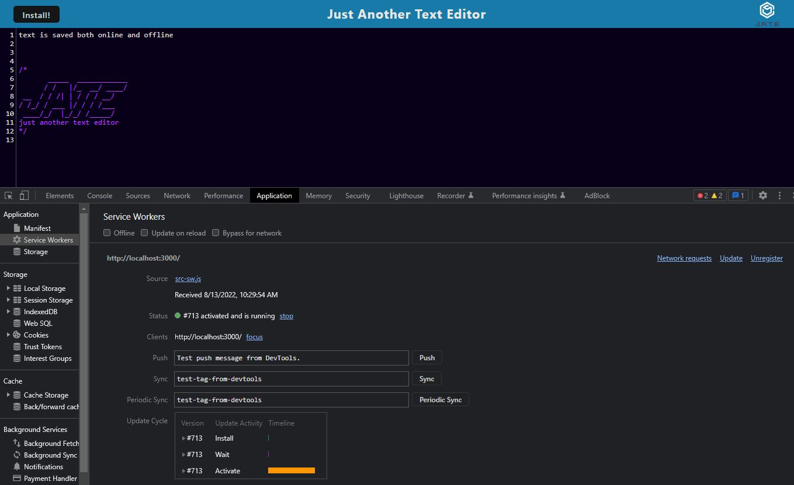
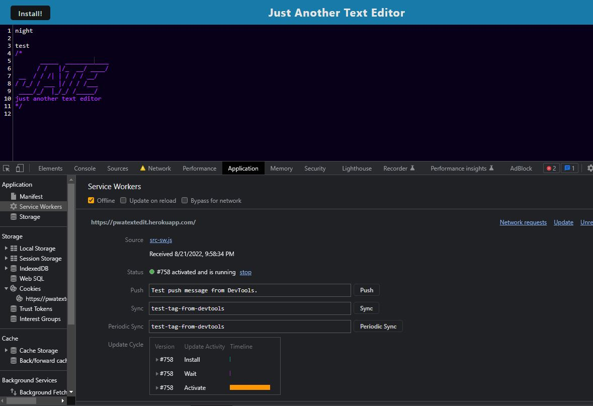

# PWA Text Editor


<br>

<a href="https://pwatextedit.herokuapp.com/">Heroku Deployment</a>
<br><br>

## Table of Contents

- [Description](#description)
- [Installation](#installation)
- [Usage](#usage)
- [Screenshots](#screenshots)
- [Technologies Used](#technologies-used)
- [Questions](#questions)
- [License](#license)

<br>

## Description

This single page application is a text editor that can function both online and offline. It is built with Progressive Web Application(PWA) criteria and features a number of data persistence techniques to serve as backups in case one of the options is not supported by the browser.

<br>
<br>

## Installation

[Node.js](https://nodejs.org/en/) installation is required. Clone repo and follow usage commands.

<br>

## Usage

<br>

This application can be used locally by entering the following commands-

<br>

Install dependencies:

```
npm install
```

<br>

Start the application/run the port:

```
node run start
```

<br>

Optional- Run the app in development mode

```
npm run start:dev
```

<br>

## Screenshots

<br>

<br>
<br>


<br>
<br>

## Technologies Used

- [Node.js](https://nodejs.org/en/)
- [Express](https://expressjs.com/)
- [Webpack](https://webpack.js.org/)
- [Babel](https://babeljs.io/)
- [Nodemon](https://www.npmjs.com/package/nodemon)
- [Concurrently](https://www.npmjs.com/package/concurrently)

<br>

## Questions

Contact me here:

- [GitHub Profile](https://github.com/mbenson025)
- Email me at mbenson025@gmail.com

<br>

## License

MIT License

Copyright (c) 2022 Mason Benson

Licensed under the [MIT](LICENSE) license.
